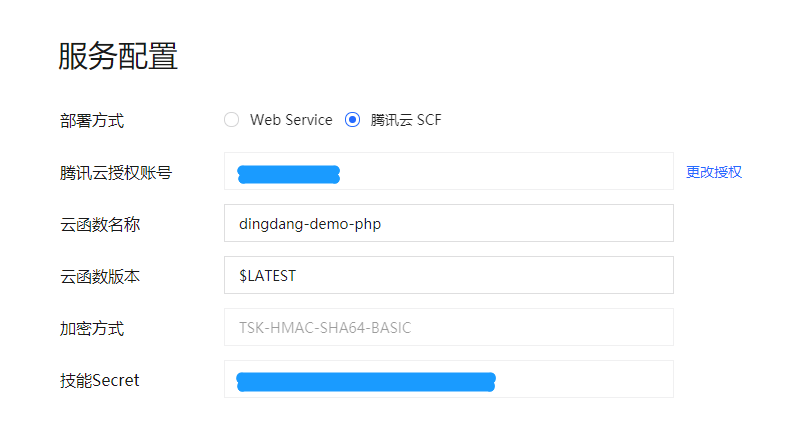

# 自定义技能开发流程

<!-- TOC depthFrom:2 depthTo:6 withLinks:1 updateOnSave:1 orderedList:0 -->

- [技能开发前准备事项](#技能开发前准备事项)
- [技能开发流程](#技能开发流程)
	- [服务配置](#服务配置)
	- [技能开发](#技能开发)
- [技能联调](#技能联调)

<!-- /TOC -->

## 技能开发前准备事项

开发自定义技能时，需要实现准备以下事项：
1. 一个公网可访问的云端服务，目前有两个可选项；
  - 自行搭建的Web服务，需要申请SSL证书以支持HTTPS，服务可以部署在任意公网可访问的位置；
  - 使用腾讯云云函数（SCF），这是最简便的方案，只需要注册腾讯云账户即可直接编写服务逻辑，服务的运维、环境的部署均由腾讯云完成，目前支持golang、python、nodejs、php、java等语言。
2. （可选）一个资源托管服务，用于托管图片、音频、视频等媒体资源；
  当技能需要在与用户交互过程中展示图片或者播放音频、视频时，需要返回该资源的URL地址。为了让用户有更好的体验，建议您的资源使用CDN进行加速，您也可以使用成熟的云产品进行媒体资源的托管。
3. 一台搭载腾讯云叮当的设备，如腾讯叮当智能屏。技能开放平台集成了“快速体验”功能用于简单模拟用户的交互，但为了让技能拥有更好的体验，强烈建议您使用购买设备进行技能调试。

## 技能开发流程

### 服务配置
1. 选择部署方式：
  - Web Service：技能选择该部署方式需要提供一个HTTPS地址，当用户的Query命中该技能后，请求会以约定的协议发往该地址，技能的数据交互协议见[自定义技能-技能协议](./custom_skill.md)；
  - 腾讯云SCF：技能选择该部署方式需要完成腾讯云函数的授权，在腾讯云访问管理中为腾讯云叮当创建一个角色用于调用腾讯云函数。同时，开发者需要填写腾讯云函数的名称及版本号用来指定该技能需要调用的函数，下图给出了示例的配置方式：

  

2. 签名校验：
  由于Web Service部署方式及腾讯云SCF部署方式都是公网可访问，腾讯云顶当在请求技能时会带上相应的签名，技能可通过验证该签名确认请求是否来自腾讯云叮当，签名算法及校验方式见[安全签名](./security.md)；

3. 授权信息配置：
  对于有账号关联需求的技能可通过[OAuth 2.0](https://tools.ietf.org/html/rfc6749)的方式进行账号关联。开发者需要打开该配置开关，并填上相应的OAuth 2.0服务信息和给腾讯云叮当分配的ClientId、ClientSecret等信息。关于如何使用账号连接见[账号连接文档](./account_linking.md)。

### 技能开发

开发技能服务的意义在于解析腾讯云叮当发送的请求，执行处理逻辑后返回相应的数据。在进行技能逻辑开发之前，强烈建议您阅读[技能设计规范](./skill_design.md)和[自定义技能-技能协议](./custom_skill.md)，了解技能的交互流程以及技能能够处理的范围。

以下内容详细说明了技能开发过程中可能需要处理的流程及处理方法：
  - [验证请求是否合法](./security.md#如何校验请求的合法性)；
  - [多轮会话过程中发起参数询问流程](./custom_skill-handle-request-sent-by-dingdang.md#多轮会话过程中发起参数询问流程)；
  - [在设备上展示图形界面](./custom_skill-handle-request-sent-by-dingdang.md#在有屏设备上展示图形界面)；
  - [了解如何使用账号连接](./custom_skill-handle-request-sent-by-dingdang.md#了解如何使用账号连接)；
  - [发起付费流程](./custom_skill-handle-request-sent-by-dingdang.md#发起付费流程)；

## 技能联调

1. 使用快速体验功能进行联调
在腾讯云叮当技能开放平台，每个技能均有单独的快速体验入口，保存好服务配置后，录入技能的语料即可将请求发往技能服务。该功能可用于技能开发前期，验证对话流程是否符合预期。目前快速体验功能尚未实现诸如展示、音频播放、视频播放等功能，因此在调试技能的输出是否符合预期时，应该使用设备进行调试。

2. 使用搭载腾讯云叮当的设备进行联调
使用设备进行技能调试时，可以比较真实地反映技能在该类型设备上线后的表现。已经发布过的技能在进行调试时，一般会将服务部署地址改成测试地址，注意在发布技能时不要将测试地址发布出去，以免影响线上用户。
