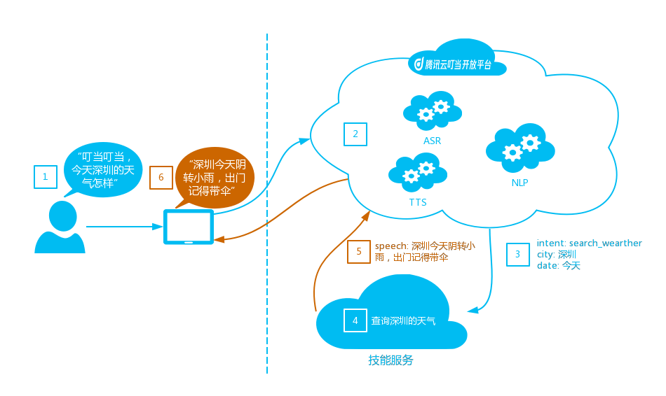
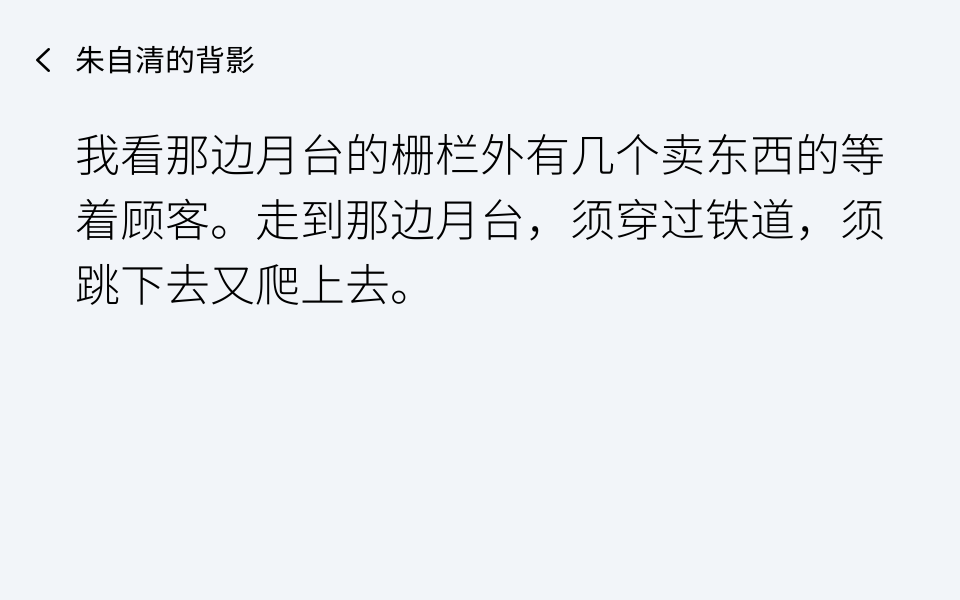

# 自定义技能

> 文档更新于2018/12/29，点击查看[更新日志](#更新日志)。

自定义技能一般用于通过设计对话的场景和交互流程，并最终通过来满足用户特定的需求，比如：天气技能用于满足用户天气查询的需求，当用户说“叮当叮当，深圳今天天气怎样”，天气技能根据解析出来的参数查询深圳当天的天气，并组织成文本回复语交给腾讯云叮当，腾讯云叮当利用语音合成技术（TTS，Text-To-Speech）将回复语播报给用户。交互流程大致如下图：

详细流程描述为：
1. 用户对腾讯叮当终端说“叮当叮当，深圳今天天气怎样”；
2. 腾讯叮当语音识别服务将用户音频转化为文本“深圳今天天气怎样”；
3. 腾讯叮当语义理解服务判断“深圳今天天气怎样”为“天气”技能的“天气查询”意图，并解析出槽位`city=深圳; date=今天`;
4. “天气”技能根据意图、槽位确定要执行查询深圳当天天气的任务，并将结果组织成自然语言返回给腾讯叮当；
5. 腾讯叮当语音合成服务将技能给出的播报文本合成语音播报给用户：“深圳今天阴转小雨，出门记得带伞”。

创建自定义技能大体分两部分工作，一部分是意图设计，另一部分是服务开发，以下内容主要介绍服务开发部分技能服务需要支持的协议。

<!-- TOC depthFrom:2 depthTo:6 withLinks:1 updateOnSave:1 orderedList:0 -->

- [请求数据格式](#请求数据格式)
	- [HTTP Header](#http-header)
	- [HTTP Body](#http-body)
	- [请求参数说明](#请求参数说明)
	- [Session Object 参数说明](#session-object-参数说明)
	- [Context Object 参数说明](#context-object-参数说明)
	- [System Object 参数说明](#system-object-参数说明)
	- [Request Object 参数说明](#request-object-参数说明)
		- [LaunchRequest 参数说明](#launchrequest-参数说明)
		- [IntentRequest 参数说明](#intentrequest-参数说明)
		- [Intent Object 参数说明](#intent-object-参数说明)
		- [Text Slot](#text-slot)
		- [Unit Slot](#unit-slot)
		- [Address Slot](#address-slot)
		- [Datetime Slot](#datetime-slot)
		- [Normal Datetime value](#normal-datetime-value)
		- [Interval Datetime value](#interval-datetime-value)
		- [Repeat Datetime value](#repeat-datetime-value)
		- [SessionEndedRequest 参数说明](#sessionendedrequest-参数说明)
		- [Connections.Response.Charge 扣款事件参数说明](#connectionsresponsecharge-扣款事件参数说明)
		- [Display.ElementSelected 参数说明](#displayelementselected-参数说明)
- [响应数据格式](#响应数据格式)
	- [HTTP Header](#http-header)
	- [HTTP Body](#http-body)
	- [响应参数说明](#响应参数说明)
	- [Response Object 参数说明](#response-object-参数说明)
	- [AudioPlayer类型的指令](#audioplayer类型的指令)
		- [AudioPlayer.Play指令](#audioplayerplay指令)
	- [VideoPlayer类型的指令](#videoplayer类型的指令)
		- [VideoPlayer.Play指令](#videoplayerplay指令)
	- [Display类型的指令](#display类型的指令)
		- [Display.RenderTemplate指令](#displayrendertemplate指令)
			- [NewsBodyTemplate 单图文模板](#newsbodytemplate-单图文模板)
			- [NewsBodyTemplate1 单图文模板](#newsbodytemplate1-单图文模板)
			- [TextBodyTemplate 单文本模板](#textbodytemplate-单文本模板)
			- [HorizontialListTemplate 横向列表模板](#horizontiallisttemplate-横向列表模板)
			- [TextContent Object 参数说明](#textcontent-object-参数说明)
			- [Image Object 参数说明](#image-object-参数说明)
			- [Audio Object 参数说明](#audio-object-参数说明)
	- [Dialog 类型的指令](#dialog-类型的指令)
		- [Dialog.ElicitSlot指令](#dialogelicitslot指令)
	- [Connections.SendRequest类型的指令](#connectionssendrequest类型的指令)
		- [Charge支付指令](#charge支付指令)
- [更新日志](#更新日志)
	- [2019/09/19 更新](#20190919-更新)
	- [2018/11/22 更新](#20181122-更新)
	- [2018/12/26 更新](#20181226-更新)
	- [2018/12/29 更新](#20181229-更新)

<!-- /TOC -->

## 请求数据格式
用户发起请求后，叮当会将该请求按照约定的协议以HTTP请求的方式转发给技能服务。**对于腾讯云SCF部署的技能的，由于技能只能接收到`context`数据，因此数据会按照如下格式将原有的HTTP数据封装到`context`中**：

```json
{
	"header": {
		"Authorization": "TSK-HMAC-SHA256-BASIC Datetime=20180101T203559Z, Signature=d8612ab1ff0301e1016d817c02350a2b76ea62e0"
	},
	"body": "{\"version\": \"1.0\",\"session\": {\".......}"
}
```

### HTTP Header

```http
POST / HTTP/1.1
Content-Type : application/json;charset=UTF-8
Host : your.application.endpoint
Accept : application/json
Accept-Charset : utf-8
Authorization: TSK-HMAC-SHA256-BASIC Datetime=20180101T203559Z, Signature=d8612ab1ff0301e1016d817c02350a2b76ea62e0
```

### HTTP Body

请求数据将以JSON格式发送到技能所在的服务地址上，以下是一个正常的叮当请求的例子：

```json
{
  "version": "1.0",
  "session": {
    "new": true,
    "sessionId": "sssss.....id"
  },
  "context": {
    "System": {
      "device": {
        "deviceId": "string",
        "supportedInterfaces": {
          "AudioPlayer": {
            "Play": true,
            "Stop": false,
            "ClearQueue": false
          }
        }
      },
      "application": {
        "applicationId": "sssssskill.......id"
      },
      "user": {
        "userId": "uuuuuuuu....id",
        "accessToken": "account....token"
      }
    }
  },
  "request": {
    "type": "IntentRequest",
    "requestId": "rrrrrr.....id",
    "timestamp": "20170720T193559Z",
    "dialogState": "string",
    "queryText": "string",
    "intent": {
      "name": "string",
      "confirmationStatus": "string",
      "slots": {
        "{{SlotName}}": {
          "name": "{{SlotName}}",
          "confirmationStatus": "string",
          "values": [{
            "value": {
              "type": "text",
              "value": "string",
              "origin": "string"
            }
          }]
        }
      }
    }
  }
}
```

> `{{SlotName}}`是技能在开放平台定义的槽位名，`request.intent.slots`可能有多个槽位，比如Query“明天上海的天气怎样”，可以提取到“明天”、“上海”两个槽位。

### 请求参数说明

| 参数        | 描述                                       | 类型       |
| --------- | ---------------------------------------- | -------- |
| `version` | 协议的版本标识，当前版本为`1.0`                       | `string` |
| `session` | 当前会话的相关信息，该数据只在请求类型为`LaunchRequest`、`IntentRequest`、`SessionEndedRequest`时才传到技能服务中，详细说明见[Session Object](#session-object-参数说明) | `object` |
| `context` | 包含了当前腾讯叮当服务和设备的状态信息，该信息会包含在所有对技能的请求中。详细说明见[Context Object](#context-object-参数说明) | `object` |
| `request` | 用户的详细请求内容，包含了几种不同类型的请求：<br>+ 标准请求<br>      - `LaunchRequest`：用户未明确意图的首次请求，如“打开贝瓦儿歌”；<br>      - `IntentRequest`：用户指定意图的请求；<br>      - `SessionEndedRequest`：技能由于其他原因被动关闭时，这种类型的请求会被发送到你的服务上；<br><br>详细说明见[Request Object](#request-object-参数说明) | `object` |

### Session Object 参数说明

| 参数          | 描述                            | 类型        |
| ----------- | ----------------------------- | --------- |
| `new`       | 是否新会话                         | `boolean` |
| `sessionId` | 用于唯一标识一次会话，在同一个会话的多个请求其ID保持不变 | `string`  |

### Context Object 参数说明

| 参数            | 描述                                       | 类型       |
| ------------- | ---------------------------------------- | -------- |
| `System`      | 腾讯叮当当前的服务和设备信息，详细说明见[System](#system-object-参数说明) | `object` |
| `AudioPlayer` | 当前设备的音频播放器状态，详细说明见[AudioPlayer]()        | `object` |

### System Object 参数说明

| 参数            | 描述                                       | 类型       |
| ------------- | ---------------------------------------- | -------- |
| `application` | 当前技能的信息，用于验证该请求正确指向你的服务，其中：<br>+ ` applicationId`：技能ID，你可以在腾讯叮当技能平台上找到该ID | `object` |
| `device`      | 当前与技能交互的设备信息：<br>+ `deviceId`：转换的设备ID，唯一标识一台设备；<br>+  `supportedInterfaces`：当前设备支持的接口类型，` AudioPlayer {}`表示该设备支持` AudioPlayer`接口 | `object` |
| `user`        | 当前与技能交互的用户信息：<br>+ `userId`：转换的用户ID，唯一标识一个叮当用户，**用户重新关注技能后可能产生新的用户ID**；<br>+ `accessToken`：用户在第三方系统的账号标识，仅在账号连接成功后才会提供，查阅[账号连接](./account_linking.md)了解更多相关信息。 | `object` |

### Request Object 参数说明

当用户以文字或语音的形式与你的技能进行交互时，腾讯叮当会给技能服务发送一个标准类型的请求（如：`LaunchRequest`、`IntentRequest`、`SessionEndedRequest`）。

#### LaunchRequest 参数说明
LaunchRequest在用户初次进入技能并且没有明确意图的时候发送给技能，比如：

> **用户**：叮当叮当，打开QQ音乐  
>   *叮当发送`LaunchRequest`到技能*  
>   *技能可以给出欢迎语，并播放热门歌曲*  
> **叮当**：欢迎使用QQ音乐，最动听的音乐送给我最喜欢的你。  
>   *技能也可以给出欢迎语，并询问用户想听什么歌*  
> **叮当**：欢迎使用QQ音乐，请问你想听什么歌？  


| 参数          | 描述                         | 类型       |
| ----------- | -------------------------- | -------- |
| `type`      | 固定为`LaunchRequest`         | `string` |
| `requestId` | 当前请求的ID，用于唯一标识一次请求         | `string` |
| `timestamp` | 用户请求时间戳，ISO 8601格式的UTC+0时间 | `string` |
| `queryText` | 用户的说话内容                         | `string` |

#### IntentRequest 参数说明
当用户有明确的意图时，腾讯叮当将发送`IntentRequest`到技能，并指明当前意图和提取出的槽位。

| 参数             | 描述                                       | 类型       |
| -------------- | ---------------------------------------- | -------- |
| `type`         | 固定为`IntentRequest`                       | `string` |
| `requestId`    | 当前请求的ID，用于唯一标识一次请求                       | `string` |
| `timestamp`    | 用户请求时间戳，ISO 8601格式的UTC+0时间               | `string` |
| ` dialogState` | 用于表示多轮对话状态的枚举值，包括：` STARTED`：会话开始；<br>` IN_PROGRESS`：会话进行中；<br>` COMPLETED`：会话结束； | `string` |
| `queryText`    | 用户的说话内容                             | `string` |
| `intent`       | 用户的意图信息，包含意图名称及提取的参数信息，详细说明见[intent](#intent-object-参数说明) | `object` |

#### Intent Object 参数说明

| 参数                                   | 描述                                       | 类型       |
| ------------------------------------ | ---------------------------------------- | -------- |
| `name`                               | 意图标识                                     | `string` |
| `confirmationStatus`                 | 当前意图的确认状态，可选值有：<br>+ `NONE`：未确认；<br>+ `CONFIRMED`：已确认；<br>+ `DENIED`：拒绝 | `string` |
| `slots`                              | 槽位信息                                     | `object`    |
| `slots.{{SlotName}}`                   | `{{SlotName}}`是占位符，会被替换成实际在技能中定义的槽位标识   | `object`    |
| `slots.{{SlotName}}.name`                | 参数名（或者叫槽位名）                        | `string` |
| `slots.{{SlotName}}.confirmationStatus`  | 当前参数的确认状态，可选值有：<br>+ `NONE`：未确认；<br>+ `CONFIRMED`：已确认；<br>+ `DENIED`：拒绝 | `string` |
| `slots.{{SlotName}}.values`              | 该参数对应的值列表                                | `array`  |
| `slots.{{SlotName}}.values[].value`      | 参数的值                                     | `object` |
| `slots.{{SlotName}}.values[].value.type` | 参数值类型，可选值有：<br>`text`：普通文本类型；<br>`unit`：度量单位类型；<br>`address`：地址类型；<br>`datetime`：时间类型； | `string` |

#### Text Slot
文本类型槽位，也是最常用的槽位类型，**所有的自定义实体、大部分的系统实体都会以该类型进行表示**。

| 参数       | 描述         | 类型       |
| -------- | ---------- | -------- |
| `type`   | 固定值：`text` | `string` |
| `value`  | 槽位的实体值     | `string` |
| `origin` | 用户原始说法     | `string` |

#### Unit Slot
用于表示带单位的系统实体，比如长度、货币等。使用该类型槽位的实体有：
+ sys.unit：所有单位
+ sys.unit.currency：货币
+ sys.unit.length：长度
+ sys.unit.duration：时间
+ sys.unit.age：年龄


| 参数       | 描述         | 类型       |
| -------- | ---------- | -------- |
| `type`   | 固定值：`unit` | `string` |
| `amount` | 数值         | `string` |
| `unit`   | 单位         | `string` |
| `origin` | 用户原始说法     | `string` |

#### Address Slot
用于表示复杂地址类型的系统实体，比如“广东省深圳市南山区深南大道10000号腾讯大厦”，使用该槽位类型的实体有：
+ sys.geo.province
+ sys.geo.county
+ sys.geo.address

| 参数         | 描述            | 类型       |
| ---------- | ------------- | -------- |
| `type`     | 固定值：`address` | `string` |
| `country`  | 国家            | `string` |
| `province` | 省             | `string` |
| `city`     | 城市            | `string` |
| `district` | 区/县           | `string` |
| `town`     | 乡镇            | `string` |
| `village`  | 村             | `string` |
| `title`    | 地名            | `string` |
| `origin`   | 用户原始说法        | `string` |

#### Datetime Slot
用于表示复杂的系统时间实体，使用该槽位类型的实体有：
+ sys.date
+ sys.date.freq
+ sys.datetime
+ sys.datetime.freq
+ sys.datetime.duration
+ sys.datetime.future

| 参数       | 描述                                       | 类型       |
| -------- | ---------------------------------------- | -------- |
| `type`   | 固定值：`datetime`                           | `string` |
| `value`  | 时间表示，分以下三种类型：<br>+ Normal datetime：单时间点，如“明天早上八点”<br>+ Interval datetime：时间段，如“下周末”<br>+ Repeat datetime：重复时间，如“每个工作日” | `object` |
| `origin` | 用户原始说法                                   | `string` |

#### Normal Datetime value
用于常规的时间表示，比如今天、明年等

| 参数              | 描述                                | 类型       |
| --------------- | --------------------------------- | -------- |
| `type`          | 固定值：`NORMAL`                      | `string` |
| `datetime`      | 具体时间点表示                           | `object` |
| `datetime.date` | 日期，如“2018”，“2018-01”，“2018-01-01” | `string` |
| `datetime.time` | 24小时制时间，如“23:59:59"               | `string` |

#### Interval Datetime value
用于表示时间间隔的实体，比如这周末、明后天等

| 参数      | 描述                                | 类型       |
| ------- | --------------------------------- | -------- |
| `type`  | 固定值：`INTERVAL`                    | `string` |
| `start` | 同Normal Datetime Value的`datetime` | `object` |
| `end`   | 同Normal Datetime Value的`datetime` | `string` |

#### Repeat Datetime value
用于表示循环时间的实体，比如每周一、每个工作日等

| 参数           | 描述                                       | 类型       |
| ------------ | ---------------------------------------- | -------- |
| `type`       | 固定值：`REPEAT`                             | `string` |
| `amount`     | 循环量                                      | `string` |
| `repeatType` | 循环单位，有以下几种类型：<br>+ `YEAR`：年<br>+ `MONTH`：月<br>+ `WEEK`：周<br>+ `DAY`：天<br>+ `HOUR`：小时<br>+ `MINUTE`：分钟<br>+ `WORKDAY`：工作日<br>+ `WEEKEND`：周末 | `string` |
| `start`      | 同Normal Datetime Value的`datetime`        | `object` |
| `end`        | 同Normal Datetime Value的`datetime`        | `object` |

#### SessionEndedRequest 参数说明
当用户主动退出该技能或者技能回复数据出现问题时，叮当会给叮当发送`SessionEndedRequest`。**对`SessionEndedRequest`的响应限制如下：**

+ `shouldEndSession`只能为`true`；
+ 只允许`Display.RenderTemplate`类型的指令；

示例场景如下：

> **用户**：叮当叮当，退出QQ音乐  
>   *叮当发送`SessionEndRequest`到技能*
>   *技能可以给出退出回复语*  
> **叮当**：再见，QQ音乐期待下次与你相遇  


| 参数              | 描述                                       | 类型       |
| --------------- | ---------------------------------------- | -------- |
| `type`          | 固定为`SessionEndedRequest`                 | `string` |
| `requestId`     | 当前请求的ID，用于唯一标识一次请求                       | `string` |
| `timestamp`     | 用户请求时间戳，ISO 8601格式的UTC+0时间               | `string` |
| `reason`        | 会话结束的原因<br>  - ` USER_INITIATED`：用户主动退出<br>  - ` ERROR`：出现意外错误 | `string` |
| `error`         | 对错误信息的详细描述                               | `object` |
| `error.type`    | 错误类型，包括：<br>` INVALID_RESPONSE`：技能响应有问题<br>` INTERNAL_ERROR`：叮当内部错误 | `string` |
| `error.message` | 错误信息说明                                   | `string` |

#### Connections.Response.Charge 扣款事件参数说明
由于技能可以通过`Connections.SendRequest.Charge`指令发起支付，在支付完成后会向技能发起该事件告知技能支付结果，此时技能可以返回内容继续为用户提供后续服务。

| 参数              | 描述                                       | 类型       |
| --------------- | ------------------------------------------- | -------- |
| `type`          | 固定为`Connections.Response`                | `string` |
| `name`          | 当前支持：`Charge`：支付结束                  | `string` |
| `requestId`     | 当前请求的ID，用于唯一标识一次请求             | `string` |
| `timestamp`     | 用户请求时间戳，ISO 8601格式的UTC+0时间        | `string` |
| `payload.dingdangOrderId` | 叮当此次交易生成的订单ID            | `string` |
| `payload.partnerOrderId`  | 商户生成的订单ID                   | `string` |

注意：对该事件的响应内容不能包含`Dialog`类型的指令，且`shouldEndSession`会置为`true`。

#### Display.ElementSelected 事件参数说明
在用户点击了宫格列表中的元素时，云小微会向技能发送`Display.ElementSelected`事件，技能可进行相应的处理并给出响应。

| 参数              | 描述                                       | 类型     |
| --------------- | ------------------------------------------- | -------- |
| `type`          | 固定为`Display.ElementSelected`              | `string` |
| `requestId`     | 当前请求的ID，用于唯一标识一次请求             | `string` |
| `timestamp`     | 用户请求时间戳，ISO 8601格式的UTC+0时间       | `string` |
| `token`         | 当前被选中的Item的`token`                    | `string` |

## 响应数据格式

### HTTP Header

```http
HTTP/1.1 200 OK
Content-Type: application/json;charset=UTF-8
```

### HTTP Body

响应数据是技能服务收到叮当请求后的返回，用于朗读TTS或者播放音视频、展示图形界面等，以下是一个技能响应数据的例子：

```json
{
  "version": "string",
  "feedbackAttributes": {
    "key1": "string value1"
  },
  "response": {
    "outputSpeech": {
      "type": "PlainText",
      "text": "Plain text string to speak"
    },
    "card": {
      "type": "LinkAccount"
    },
    "directives": [
      {
        "type": "InterfaceName.Directive"
        ...
      }
    ],
    "shouldEndSession": true
  }
}
```

### 响应参数说明

| 参数         | 描述                                       | 类型       | 必需   |
| ---------- | ---------------------------------------- | -------- | ---- |
| `version`  | 协议的版本标识，当前版本为`1.0`                       | `string` | 是    |
| `response` | 技能响应内容以及是否结束当前会话状态，详细说明见[Response Object](#response-object-参数说明) | `object` | 是    |
| `feedbackAttributes` | 设备厂商自建技能专用，用于从自建技能将数据透传给终端，需要保证请求的设备和技能在同一项目下，该字段数据大小需限制在1K以下 | `map` | 否 |

### Response Object 参数说明

| 参数                  | 描述                                       | 类型        | 必需                      |
| ------------------- | ---------------------------------------- | --------- | ----------------------- |
| `outputSpeech`      | 回答用户的语音内容，将以TTS技术朗读出来         | `object`  | 是                       |
| `outputSpeech.type` | 当前只支持`PlainText`                        | `string`  | 是                       |
| `outputSpeech.text` | 回答用户的语音内容                            | `string`  | 是（当`type`为`PlainText`时） |
| `shouldEndSession`  | 用于通知腾讯叮当是否结束当前会话，该字段不存在时使用默认值`true`：<br>+ `true`表示结束当前会话；<br>+ `false`表示会话继续，一般情况下返回`false`终端会自动打开麦克风收音；       | `boolean` | 否                       |
| `directives`        | 指令列表，支持的类型有：<br>+ AudioPlayer 类型的指令<br>+ VideoPlayer 类型的指令<br>+ Display 类型的指令<br>+ Dialog 类型的指令<br>+ Connections.SendRequest.Charge 类型的指令 | `array`   | 否                       |
| `card`              | 卡片数据，可以在需要用户登陆时弹出账号连接卡片，卡片可能被发送到有屏设备或者手机APP上 | `object` | 否 |
| `card.type`         | 卡片类型，目前支持：<br> + `LinkAccount`: 账号连接卡片，关于账号连接见[文档说明](./account_linking.md) | 否 |

### AudioPlayer类型的指令
该类型的指令用于指示腾讯叮当终端执行音频播控相关的操作。

#### AudioPlayer.Play指令
播放音频列表。

+ 消息样例

```json
{
  "type": "AudioPlayer.Play",
  "playlist": [
    {
      "stream": {
        "url": "string",
        "token": "string"
      },
      "info": {
        "title": "string",
        "subtitle": "string",
        "art": {
          "source": {
            "url": "string"
          }
        }
      },
      "pay": false
    }
  ]
}
```

+ 参数说明

| 参数                         | 描述                                       | 类型       | 必需   |
| -------------------------- | ---------------------------------------- | -------- | ---- |
| `type`                     | 固定值：`AudioPlayer.Play`                   | `string` | 是    |
| `playlist`                 | 音频列表                                     | `array`  | 是    |
| `playlist[].stream`        | 音频流信息                                   | `object` | 是    |
| `playlist[].stream.url`    | 音频流地址                                   | `string` | 否    |
| `playlist[].stream.token`  | 唯一标识此音频流的token                       | `string` | 是    |
| `playlist[].info`          | 音频信息                                     | `object` | 否    |
| `playlist[].info.title`    | 音频的标题                                   | `string` | 是    |
| `playlist[].info.subtitle` | 音频的副标题，建议是音乐类别或歌手姓名          | `string` | 否    |
| `playlist[].info.art`      | 音频的封面图片信息，见[Image Object](#image-object-参数说明) | `object` | 否    |
| `playlist[].pay`           | 音频是否需要付费，默认为`false`：`true`表示该音频未购买，需要购买才能后才能收听（`playlist[].stream.url`需要同时设置为空）；`false`表示该音频已购买或者不需要付费购买 | `boolean` | 否    |


### VideoPlayer类型的指令
该类型的指令用于指示腾讯叮当终端执行视频播控相关的操作。

#### VideoPlayer.Play指令
播放视频（当前只支持播放单个视频，视频列表播放能力后续支持）。

+ 消息样例

```json
{
  "type": "VideoPlayer.Play",
  "playBehavior": "string",
  "playlist": [
    {
      "stream": {
        "url": "string",
        "token": "string"
      }
    }
  ]
}
```

+ 参数说明

| 参数                         | 描述                                       | 类型       | 必需   |
| -------------------------- | ---------------------------------------- | -------- | ---- |
| `type`                     | 固定值：`VideoPlayer.Play`                   | `string` | 是    |
| `playBehavior`             | 控制视频播放操作及播放队列，有两种取值：<br />+ `REPLACE_ALL`：默认值，停止当前正在播放的视频并替换队列中的所有视频；<br />+ `ENQUEUE`：将视频加入到播放队列的末尾;    | `string` | 否    |
| `playlist`                 | 播放列表                                     | `array`  | 是    |
| `playlist[].stream`        | 视频流                                      | `object` | 是    |
| `playlist[].stream.url`    | 视频流地址                                    | `string` | 是    |
| `playlist[].stream.token`  | 唯一标识此视频流的token                           | `string` | 是    |

### Display类型的指令

#### Display.RenderTemplate指令

`Display.RenderTemplate`指令用于支持技能能够在带屏幕终端展示，技能服务使用平台定义的模板构造适合技能的展示样式。TSK技能开放平台提供两种类型的展示模板：

1. 单条内容显示模板，用于展示文本及图文信息；
2. 列表显示模板，用于显示列表的数据，列表的组成元素可以是文本、图文；

不同的模板在终端上其元素的大小、位置可能不尽相同，但是每个模板都是经过精心选择并有相对稳定的结构。技能开发者在构造包含显示模板的响应时，可以根据需要精心选择合适的模板，并配上响应的文本、图像、音频，给用户提供最好的、一致的体验。

##### NewsBodyTemplate 单图文模板
目前单图文模板只支持3行文本（约54个汉字）显示，多于3行的内容将隐藏。

+ 消息样例

```json
{
  "type": "Display.RenderTemplate",
  "token": "string",
  "template": {
    "type": "NewsBodyTemplate",
    "textContent": TextContent,
    "backgroundImage": Image,
    "backgroundAudio": Audio
  }
}
```

+ 参数说明

| 参数                         | 描述                                       | 类型       | 必需   |
| -------------------------- | ---------------------------------------- | -------- | ---- |
| `type`                     | 固定值：`Display.RenderTemplate`             | `string` | 是    |
| `token`                    | 模板token，用于标识该内容                          | `string` | 是    |
| `template`                 | 显示模板                                     | `object` | 是    |
| `template.type`            | 固定值：`NewsBodyTemplate`                   | `string` | 是    |
| `template.textContent`     | 文本内容，见[TextContent Object](#textcontent-object-参数说明) | `object` | 是    |
| `template.backgroundImage` | 背景图片，见[Image Object](#image-object-参数说明) | `object` | 否    |
| `template.backgroundAudio` | 背景音频，见[Audio Object](#audio-object-参数说明) | `object` | 否    |

+ 卡片样例


##### NewsBodyTemplate1 单图文模板
目前单图文模板1只支持2行文本显示，多于2行的内容将隐藏。

+ 消息样例

```json
{
  "type": "Display.RenderTemplate",
  "token": "string",
  "template": {
    "type": "NewsBodyTemplate1",
    "textContent": TextContent,
    "backgroundImage": Image,
    "backgroundAudio": Audio
  }
}
```

+ 参数说明

| 参数                         | 描述                                       | 类型       | 必需   |
| -------------------------- | ---------------------------------------- | -------- | ---- |
| `type`                     | 固定值：`Display.RenderTemplate`             | `string` | 是    |
| `token`                    | 模板token，用于标识该内容                          | `string` | 是    |
| `template`                 | 显示模板                                     | `object` | 是    |
| `template.type`            | 固定值：`NewsBodyTemplate1`                   | `string` | 是    |
| `template.textContent`     | 文本内容，见[TextContent Object](#textcontent-object-参数说明) | `object` | 是    |
| `template.backgroundImage` | 背景图片，见[Image Object](#image-object-参数说明) | `object` | 否    |
| `template.backgroundAudio` | 背景音频，见[Audio Object](#audio-object-参数说明) | `object` | 否    |

+ 卡片样例


##### TextBodyTemplate 单文本模板

- 消息样例

```json
{
  "type": "Display.RenderTemplate",
  "token": "string",
  "template": {
    "type": "TextBodyTemplate",
    "textContent": TextContent
  }
}
```

- 参数说明

| 参数                     | 描述                                       | 类型       | 必需   |
| ---------------------- | ---------------------------------------- | -------- | ---- |
| `type`                 | 固定值：`Display.RenderTemplate`             | `string` | 是    |
| `token`                | 模板token，用于标识该内容                          | `string` | 是    |
| `template`             | 显示模板                                     | `object` | 是    |
| `template.type`        | 固定值：`TextBodyTemplate`                   | `string` | 是    |
| `template.textContent` | 文本内容，见[TextContent Object](#textcontent-object-参数说明) | `object` | 是    |

+ 卡片样例


##### HorizontialListTemplate 横向列表模板

- 消息样例

```json
{
  "type": "Display.RenderTemplate",
  "token": "string",
  "template": {
    "type": "HorizontialListTemplate ",
    "listItems":[{
        "token": "string",
        "textContent": TextContent,
        "image": Image
      }]
  }
}
```

- 参数说明

| 参数                                 | 描述                                       | 类型       | 必需   |
| ---------------------------------- | ---------------------------------------- | -------- | ---- |
| `type`                             | 固定值：`Display.RenderTemplate`             | `string` | 是    |
| `token`                            | 模板token，用于标识该内容                          | `string` | 是    |
| `template`                         | 显示模板                                     | `object` | 是    |
| `template.type`                    | 固定值：`HorizontialListTemplate`            | `string` | 是    |
| `template.listItems`               | 列表                                       | `array`  | 是    |
| `template.listItems[].token`       | 列表元素的token                               | `string` | 是    |
| `template.listItems[].image`       | 图片，见[Image Object](#image-object-参数说明)   | `object` | 否    |
| `template.listItems[].textContent` | 文本内容，见[TextContent Object](#textcontent-object-参数说明) | `object` | 是    |

+ 卡片样例


##### TextContent Object 参数说明

+ 消息样例

```json
{
  "title": "string",
  "description": "string"
}
```

+ 参数说明

| 参数            | 描述   | 类型       | 必须   |
| ------------- | ---- | -------- | ---- |
| `title`       | 标题文本 | `string` | 是    |
| `description` | 内容描述文本，一般用于对标题的补充，对内容的进一步说明 | `string` | 否    |

##### Image Object 参数说明

+ 消息样例

```json
{
  "contentDescription": "string",
  "source": {
    "url": "string"
  }
}
```

+ 参数说明

| 参数                   | 描述     | 类型       | 必须   |
| -------------------- | ------ | -------- | ---- |
| `contentDescription` | 图片内容描述，**该字段只用于图片加载中、加载失败情况下，替代图片显示用途，正常情况下不显示** | `string` | 否    |
| `source`             | 图片源    | `object` | 是    |
| `source.url`         | 图片源URL | `string` | 是    |

##### Audio Object 参数说明

- 消息样例

```json
{
  "source": {
    "url": "string"
  }
}
```

- 参数说明

| 参数           | 描述    | 类型       | 必须   |
| ------------ | ----- | -------- | ---- |
| `source`     | 音频源   | `object` | 是    |
| `source.url` | 音频URL | `string` | 是    |

### Dialog 类型的指令
Dialog类型的指令主要用于对话流程的控制，比如更新会话过程中的意图、参数，控制会话流程等。一个技能在完成一次响应可能需要经过多次的往返询问和确认。

#### Dialog.ElicitSlot指令
用于向用户询问某个槽位，用户的下一次正确回答将被填充到该槽位中。
+ 消息样例

> **用户**：叮当叮当，帮我打个车  
>   *技能返回`Dialog.ElicitSlot`指令，指明`slotToElicit`为`destination`*  
> **叮当**：请问你要去哪里？  
> **用户**：公司  
>   *叮当将“公司”提取为`destination`的槽位值*  

```json
{
  "type": "Dialog.ElicitSlot",
  "slotToElicit": "{{SlotName1}}",
  "updatedIntent": {
    "name": "string",
    "confirmationStatus": "string",
    "slots": {
      "{{SlotName2}}": {
        "name": "{{SlotName2}}",
        "confirmationStatus": "string",
        "values": [{
          "value": {
            "type": "text",
            "value": "string",
            "origin": "string"
          }
        }]
      }
    }
  }
}
```

> + `{{SlotName}}`是技能在开放平台定义的槽位名，在上述打车例子中，将替换成`destination`。  
> + **`updatedIntent`中的语义信息将覆盖原有会话的语义信息**，因此如果技能只是更新部分槽位值，应该在请求中`request.intent`的基础上进行更新。  

+ 参数说明

| 参数              | 描述                                       | 类型       | 必需   |
| --------------- | ---------------------------------------- | -------- | ---- |
| `type`          | 固定值：`Dialog.ElicitSlot`                  | `string` | 是    |
| `slotToElicit`  | 指示腾讯叮当需要询问的参数名                           | `string` | 是    |
| `updatedIntent` | 意图结构体，技能服务可以通过改变结构体的参数值或确认状态，详细信息见[Intent Object](#intent-object-参数说明) | `object` | 否    |


### Connections.SendRequest类型的指令

#### Charge支付指令
支付指令主要用于在语音交互中向终端发起支付请求，以便让用户完成支付，更多关于订单创建、订单查询、退款等支付相关的接口请查阅[支付说明文档](./pay.md)。

+ 消息样例

```json
{
  "type": "Connections.SendRequest",
  "name": "Charge",
  "payload": {
      "chargeInfo": {
          "name": "string",
          "description": "string",
          "userId": "string",
          "items": [{
              "itemId": "string",
              "itemName": "string",
              "price": 10,
              "totalFee": 100,
              "count": 10
          }]
      }
  }
}
```

+ 参数说明

| 参数                         | 描述                                       | 类型       | 必需   |
| -------------------------- | ---------------------------------------- | -------- | ---- |
| `type`                     | 固定值：`Connections.SendRequest`         | `string` | 是    |
| `name`                     | 固定为`Charge`，表示支付指令               | `string` | 是    |
| `payload.chargeInfo`                    | 收费信息                                  | `object` | 是    |
| `payload.chargeInfo.userId`             | 用户在商户平台的用户ID，用于后续的信息回传，若不支持账号连接，需要传该字段   | `string` | 否    |
| `payload.chargeInfo.name`               | 收费名称                                  | `string` | 是    |
| `payload.chargeInfo.description`        | 收费描述                                  | `string` | 否    |
| `payload.chargeInfo.items`              | 商品子类                                  | `array`  | 是    |
| `payload.chargeInfo.items[].itemId`     | 商品ID                                    | `string` | 是    |
| `payload.chargeInfo.items[].itemName`   | 商品名称                                  | `string` | 是    |
| `payload.chargeInfo.items[].totalFee`   | 总金额，单位为分                           | `int`    | 是    |
| `payload.chargeInfo.items[].price`      | 商品单价，单位为分                         | `int`    | 是    |
| `payload.chargeInfo.items[].count`      | 商品数量                                  | `int`    | 是    |


## 更新日志
### 2019/09/19 更新

+ 切换支付相关指令；

### 2018/11/22 更新

+ 修正`updateIntent`中`slots[]`结构的错误；

### 2018/12/26 更新

+ 新增`VideoPlayer.Play`指令；

### 2018/12/29 更新

+ 新增账号连接`card`卡片说明；
