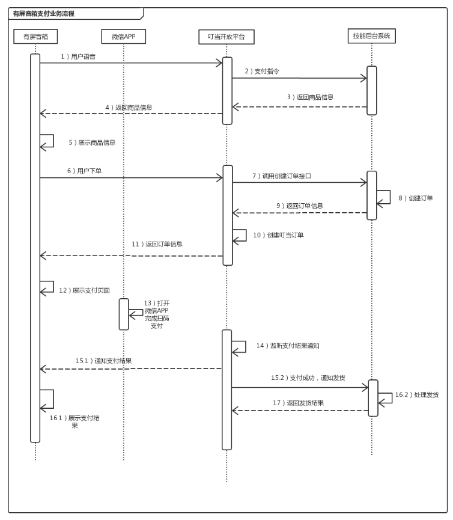
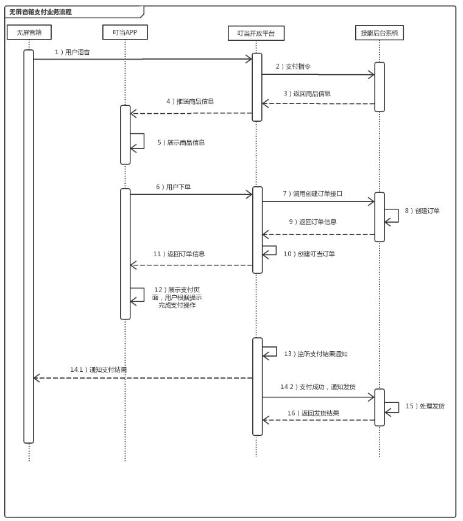

## 开放平台支付说明文档

### 支付业务流程

#### 1 有屏音箱支付业务流程

#### 2 无屏音箱支付业务流程

#### 3 有屏音箱支付成功跳转流程

## 接口说明

**注意：该文档中的请求接口都需要安全验证，验证方法：[安全签名](./security.md)**

### 1 创建订单

用户下单时，叮当调用合作方提供的接口创建订单，合作商需要接收处理，并返回应答。

**接口链接：合作方提供**

**请求方法：post**

 **参数说明：json格式**

| 参数            | 必填 | 描述                   | 类型         |
| --------------- | ---- | ---------------------- | ------------ |
| `skillId`      | 是   | 技能ID，叮当平台分配   | `string(20)` |
| `userId` | 是   | 合作方用户id | `string(32)` |
| `itemId` | 是   | 合作方商品id，唯一标识商品 | `string(32)` |
| `quantity` | 是 | 商品数量 | `int` |
| `totalAmt`      | 是   | 订单总金额，以分为单位 | `long`    |
| `nonceStr`      | 是   | 随机字符串             | `string(32)` |

**返回参数：**

| 参数      | 必填 | 描述                                  | 类型         |
| --------- | ---- | ------------------------------------- | ------------ |
| `retCode` | 是   | 返回码, SUCCESS/FAIL，SUCCESS表示成功 | `string(8)`  |
| `retMsg`  | 否   | 错误描述                              | `string(32)` |

**以下字段在retCode为SUCCESS时返回**

| 参数      | 必填 | 描述                                                         | 类型         |
| --------- | ---- | ------------------------------------------------------------ | ------------ |
| `tradeNo` | 是   | 合作方订单号，需要保证唯一， 要求32个字符内，只能是数字、大小写字母 | `string(32)` |

### 2 通知发货

用户支付成功后，叮当会通知合作商发货给用户，合作商需要接收处理，并返回应答。

对后台通知交互时，如果叮当收到合作商的应答不是成功或者超时，叮当认为通知失败，叮当会通过一定的策略定期重新发起通知，尽可能提高通知的成功率，但叮当不保证通知最终能成功。

***注意：同样的通知可能会多次发送给合作商系统。合作商系统必须能够正确处理重复的通知。***

**接口链接：合作方提供**

**请求方法：post**

 **参数说明：json格式**

| 参数            | 必填 | 描述                   | 类型         |
| --------------- | ---- | ---------------------- | ------------ |
| `skillId`      | 是   | 技能ID，叮当平台分配   | `string(20)` |
| `transactionId` | 是   | 叮当平台交易流水号     | `string(32)` |
| `tradeNo`       | 是   | 合作方订单号          | `string(32)` |
| `totalAmt`      | 是   | 订单总金额，以分为单位 | `long`    |
| `nonceStr`      | 是   | 随机字符串             | `string(32)` |

**返回参数：**

合作方处理发货通知参数后，同步返回给叮当

| 参数      | 必填 | 描述                                                        | 类型         |
| --------- | ---- | ----------------------------------------------------------- | ------------ |
| `retCode` | 是   | 返回码, SUCCESS/FAIL，SUCCESS表示商户接收通知成功并校验成功 | `string(8)`  |
| `retMsg`  | 否   | 错误描述                                                    | `string(32)` |

### 3 查询订单

 **接口链接：https://aiwx.html5.qq.com/paycgi/orderquery**

**请求方法：post**

 **参数说明：**

| 参数            | 必填   | 描述                                               | 类型         |
| --------------- | ------ | -------------------------------------------------- | ------------ |
| `skillId`      | 是     | 技能ID，叮当平台分配                               | `string(20)` |
| `transactionId` | 二选一 | 叮当平台交易流水号，`transactionId，tradeNo`二选一 | `string(32)` |
| `tradeNo`       | 二选一 | 合作方订单号`transactionId，tradeNo`二选一         | `string(32)` |
| `nonceStr`      | 是     | 随机字符串                                         | `string(32)` |

**返回结果：**

| 参数      | 必填 | 描述                                  | 类型         |
| --------- | ---- | ------------------------------------- | ------------ |
| `retCode` | 是   | 返回码，SUCCESS/FAIL，SUCCESS表示成功 | `string(8)`  |
| `retMsg`  | 否   | 错误描述                              | `string(32)` |

**以下字段在retCode为SUCCESS时返回**

| 参数              | 必填 | 描述                                                         | 类型         |
| ----------------- | ---- | ------------------------------------------------------------ | ------------ |
| `skillId`        | 是   | 技能ID，叮当平台分配                                         | `string(20)` |
| `transactionId`   | 是   | 叮当平台交易流水号                                           | `string(32)` |
| `tradeNo`         | 是   | 合作方订单号                                                 | `string(32)` |
| `totalAmt`        | 是   | 订单总金额，以分为单位                                       | `long`    |
| `tradeStatus`     | 是   | 订单状态， NOTPAY 未支付，PROCESSING支付中，SUCCESS支付成功，FAIL支付失败 | `string(16)` |
| `tradeStatusDesc` | 是   | 订单状态描述                                                 | `string(16)` |

### 4 申请退款

 **接口链接：https://aiwx.html5.qq.com/paycgi/refund**

**请求方法：post**

 **参数说明：**

| 参数            | 必填   | 描述                   | 类型         |
| --------------- | ------ | ---------------------- | ------------ |
| `skillId`      | 是     | 技能ID，叮当平台分配   | `string(20)` |
| `transactionId` | 二选一 | 叮当平台交易流水号     | `string(32)` |
| `tradeNo`       | 二选一 | 合作方订单号           | `string(32)` |
| `refundTradeNo` | 是     | 合作方退款订单号，需保证唯一， 要求32个字符内，只能是数字、大小写字母 | `string(32)` |
| `totalAmt`      | 是     | 订单总金额，以分为单位 | `long`    |
| `refundAmt`     | 是     | 退款总金额，以分为单位 | `long`   |
| `refundDesc`    | 否     | 退款原因描述           | `string(64)` |
| `nonceStr`      | 是     | 随机字符串             | `string(32)` |

**返回结果：**

| 参数      | 必填 | 描述                                                  | 类型         |
| --------- | ---- | ----------------------------------------------------- | ------------ |
| `retCode` | 是   | 返回码，SUCCESS/FAIL，SUCCESS表示叮当平台受理退款申请 | `string(8)`  |
| `retMsg`  | 否   | 错误描述                                              | `string(32)` |

**以下字段在retCode为SUCCESS时返回**

| 参数                  | 必填 | 描述                   | 类型         |
| --------------------- | ---- | ---------------------- | ------------ |
| `skillId`            | 是   | 技能ID，叮当平台分配   | `string(20)` |
| `transactionId`       | 是   | 叮当平台交易流水号     | `string(32)` |
| `tradeNo`             | 是   | 合作方订单号           | `string(32)` |
| `refundTransactionId` | 是   | 叮当平台退款订单号     | `string(32)` |
| `refundTradeNo`       | 是   | 合作方退款订单号       | `string(32)` |
| `totalAmt`            | 是   | 订单总金额，以分为单位 | `long`    |
| `refundAmt`           | 是   | 退款总金额，以分为单位 | `long`    |

### 5 查询退款

 **接口链接：https://aiwx.html5.qq.com/paycgi/refundquery**

**请求方法：post**

 **参数说明：json格式**

| 参数                  | 必填   | 描述                 | 类型         |
| --------------------- | ------ | -------------------- | ------------ |
| `skillId`            | 是     | 技能ID，叮当平台分配 | `string(20)` |
| `refundTransactionId` | 二选一 | 叮当平台退款订单号   | `string(32)` |
| `refundTradeNo`       | 二选一 | 合作方退款订单号     | `string(32)` |
| `nonceStr`            | 是     | 随机字符串           | `string(32)` |

**返回参数：**

合作方处理退款结果通知参数后，同步返回给叮当

| 参数      | 必填 | 描述                                  | 类型         |
| --------- | ---- | ------------------------------------- | ------------ |
| `retCode` | 是   | 返回码，SUCCESS/FAIL，SUCCESS表示成功 | `string(8)`  |
| `retMsg`  | 否   | 错误描述                              | `string(32)` |

**以下字段在retCode为SUCCESS时返回**

| 参数                  | 必填 | 描述                                                       | 类型         |
| --------------------- | ---- | ---------------------------------------------------------- | ------------ |
| `skillId`            | 是   | 技能ID，叮当平台分配                                       | `string(20)` |
| `transactionId`       | 是   | 叮当平台交易流水号                                         | `string(32)` |
| `tradeNo`             | 是   | 合作方订单号                                               | `string(32)` |
| `refundTransactionId` | 是   | 叮当平台退款订单号                                         | `string(32)` |
| `refundTradeNo`       | 是   | 合作方退款订单号                                           | `string(32)` |
| `totalAmt`            | 是   | 订单总金额，以分为单位                                     | `long`    |
| `refundAmt`           | 是   | 退款总金额，以分为单位                                     | `long`    |
| `refundStatus`        | 是   | 退款状态， PROCESSING退款中，SUCCESS退款成功，FAIL退款失败 | `string(16)` |
| `refundStatusDesc`    | 是   | 退款状态描述                                               | `string(16)` |

### 6 退款结果通知

此接口非必须，CP可以通过定时调用退款接口查询退款状态。 

**接口链接：合作方提供**

**请求方法：post**

 **参数说明：json格式**

| 参数                  | 必填 | 描述                                                       | 类型         |
| --------------------- | ---- | ---------------------------------------------------------- | ------------ |
| `skillId`            | 是   | 技能ID，叮当平台分配                                       | `string(20)` |
| `transactionId`       | 是   | 叮当平台交易流水号                                         | `string(32)` |
| `tradeNo`             | 是   | 合作方订单号                                               | `string(32)` |
| `refundTransactionId` | 是   | 叮当平台退款订单号                                         | `string(32)` |
| `refundTradeNo`       | 是   | 合作方退款订单号                                           | `string(32)` |
| `totalAmt`            | 是   | 订单总金额，以分为单位                                     | `long`    |
| `refundAmt`           | 是   | 退款总金额，以分为单位                                     | `long`    |
| `refundStatus`        | 是   | 退款状态， PROCESSING退款中，SUCCESS退款成功，FAIL退款失败 | `string(16)` |
| `refundStatusDesc`    | 是   | 退款状态描述                                               | `string(16)` |
| `nonceStr`            | 是   | 随机字符串                                                 | `string(32)` |

**返回参数：**

合作方处理退款结果通知参数后，同步返回给叮当

| 参数      | 必填 | 描述                                                        | 类型         |
| --------- | ---- | ----------------------------------------------------------- | ------------ |
| `retCode` | 是   | 返回码，SUCCESS/FAIL，SUCCESS表示商户接收通知成功并校验成功 | `string(8)`  |
| `retMsg`  | 否   | 错误描述                                                    | `string(32)` |

