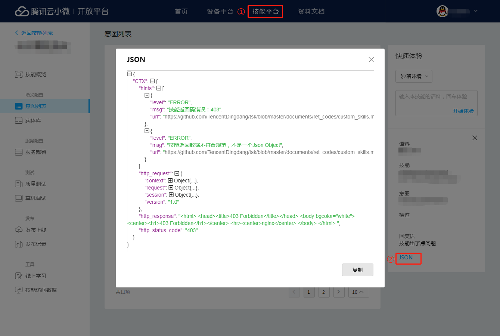

# 自定义技能返回码说明 <!-- omit in toc -->
返回码用于协助开发者定位自定义技能开发过程中遇到的问题。目前详细的错误信息只在沙箱环境下开启，建议在开发技能时使用云小微技能开放平台的“快速体验”功能并切换到**沙箱环境**，详细的提示信息可以在发起请求后从“JSON”链接中点开查看。


- [平台配置/操作类](#%e5%b9%b3%e5%8f%b0%e9%85%8d%e7%bd%ae%e6%93%8d%e4%bd%9c%e7%b1%bb)
  - [100101](#100101)
  - [100201](#100201)
- [技能处理异常类](#%e6%8a%80%e8%83%bd%e5%a4%84%e7%90%86%e5%bc%82%e5%b8%b8%e7%b1%bb)
  - [100400](#100400)
  - [100401](#100401)
  - [100402](#100402)
  - [100403](#100403)
  - [100405](#100405)
  - [100406](#100406)
  - [100501](#100501)
  - [100502](#100502)
  - [200501](#200501)
  - [200502](#200502)
  - [200503](#200503)
- [平台类错误](#%e5%b9%b3%e5%8f%b0%e7%b1%bb%e9%94%99%e8%af%af)
  - [100302](#100302)
  - [100301](#100301)

## 平台配置/操作类
这类返回码一般是在未在平台上正确操作时给出的提示信息。

### 100101
技能未填写“服务部署”配置。

#### 排查方法
我在沙箱环境收到该返回码，表示该技能未在云小微技能平台填写“服务部署”相关的配置，请填写后并保存；
我在正式环境收到该返回码，但是沙箱环境不会有该返回码，表示该技能未将“服务部署”的配置发布，请将该技能发布上线后解决。
在解决了问题之后，我们建议您阅读[技能发布的说明](https://dingdang.qq.com/doc/page/67)，更加深入了解技能发布的流程。

### 100201
当前技能未开启UI事件支持。

#### 排查方法
若您的设备支持GUI操作，需要联系腾讯云小微的对接负责人开启该事件的支持。若不需要支持该事件，请联系该提示即可。

## 技能处理异常类
这类返回码一般是技能服务在处理云小微的请求时返回了不合规范的数据造成的，技能协议规范可以查阅云小微[自定义技能协议规范](https://dingdang.qq.com/doc/page/89)。

### 100400
调用当前技能的部署服务异常。

#### 排查方法
+ Web Service部署

    1. 请确认当前技能的服务部署地址是一个公网可访问的地址，并且HTTPS证书合法；
    2. 请确认当前技能服务处理时间未超时，一般建议技能响应时间控制在1000ms以内，若处理时间过长平台会主动超时；

+ 腾讯云SCF部署

    1. 请确认当前技能的云函数已经授权，并且未在腾讯云平台上取消授权关系；
    2. 请确认当前技能的云函数名、版本号正确，并且部署地址是**广州**；
    3. 请确认云函数内部的处理时间未超时，一般建议云函数内部处理时间控制在1000ms以内；
    4. 若以上均正常，排查当前请求是否处于云函数示例被回收后，云函数实例重新启动一般需要更长的时间，可通过设置3秒的定时触发器来保持云函数不被停止/回收；

### 100401
调用技能Web Service服务超时。

#### 排查方法
一般建议技能响应时间控制在1000ms以内，若处理时间过长平台会主动超时；

### 100402
技能Web Service服务HTTP返回码非`200 OK`。

#### 排查方法
检查您的后台服务的日志，确认该时间点服务是否正常。可以通过云小微技能开放平台的沙箱环境尝试调用技能，复现技能服务的返回码和返回的数据。

### 100403
调用技能云函数超时。

#### 排查方法
排查当前请求是否处于云函数示例被回收后，云函数实例重新启动一般需要更长的时间，可通过设置约3分钟的定时触发器来保持云函数不被停止/回收。

### 100405
腾讯云云函数返回的数据异常。

#### 排查方法

1. 请确认当前技能的云函数已经授权，并且未在腾讯云平台上取消授权关系；
2. 请确认当前技能的云函数名、版本号正确，并且部署地址是**广州**；
3. 请确认云函数内部的处理时间未超时，一般建议云函数内部处理时间控制在1000ms以内；
4. 若以上均正常，排查当前请求是否处于云函数示例被回收后，云函数实例重新启动一般需要更长的时间，可通过设置3秒的定时触发器来保持云函数不被停止/回收；

### 100406
云函数返回数据格式异常。可能返回的数据不是Json格式，或者不是类似以下的规范：

```json
{
    "header": {
        "Content-Type": "application/json"
    },
    "body": "{\"version\": \"1.0\", \"response\": {...}}"
}
```
#### 排查方法
检查云函数返回的数据格式是否符合规范，`body`字段是否为`string`类型，是否有多余的转义。

### 100501
技能数据格式错误，请确认技能数据为标准的JSON格式。技能协议规范可以查阅云小微[自定义技能协议规范](https://dingdang.qq.com/doc/page/89)。

#### 排查方法

1. 通过查阅云小微[自定义技能协议规范](https://dingdang.qq.com/doc/page/89)检查技能响应数据是否正常；
2. 通过JSON Schema检查返回的数据是否正确；

### 100502
技能当前返回了不可用的指令。在部分场景下，只有受限的指令可在当前状态下使用。

#### 排查方法
1. 确认未在`SessionEndedRequest`时，返回非`Display.RenderTemplate`指令；
2. 确认未返回平台未定义的指令类型。

### 200501
技能返回数据缺失部分必须的字段。

#### 排查方法

1. 通过查阅云小微[自定义技能协议规范](https://dingdang.qq.com/doc/page/89)检查技能响应数据是否正常；
2. 通过JSON Schema检查返回的数据是否正确；

### 200502
技能返回数据部分字段当前状态不可用。

#### 排查方法
1. 若返回数据中包含`feedbackAttributes`，确认当前请求终端与技能在同一项目下，若在云小微技能平台的“快速体验”下请忽略该提示；
2. 若返回数据包含`response.card`，请确认当前技能是否已经配置“服务部署 - 授权信息配置”，并且技能的发布状态正确。

### 200503
技能返回数据部分字段平台未定义。

#### 排查方法

1. 通过查阅云小微[自定义技能协议规范](https://dingdang.qq.com/doc/page/89)检查技能响应数据是否正常；
2. 通过JSON Schema检查返回的数据是否正确；

## 平台类错误
### 100302
解析云函数数据异常。

#### 排查方法
请联系腾讯云小微对接人确认。

### 100301
生成技能请求异常。

#### 排查方法
请联系腾讯云小微对接人确认。